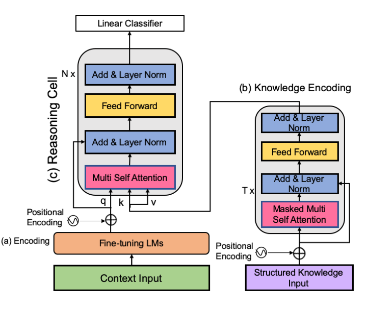

# Social-Commonsense-Reasoning-Multi-Head-Knowledge-Attention

This directory contains the following parts of the 'Social Commonsense Reasoning Multi-Head Knowledge Attention' experiment. 

<p align="center">
  
</p>

## Reference

If you make use of the contents of this repository, please cite [the following paper](https://www.aclweb.org/anthology/N19-1368):

```bib
@inproceedings{paul-frank-2020-mhka,
    title = "Social Commonsense Reasoning with Multi-Head Knowledge Attention",
    author = "Paul, Debjit  and Frank, Anette",
    booktitle = "Findings of EMNLP",
    month = November,
    year = 2020,
    publisher = "Association for Computational Linguistics"
}
```

## Recreating Results
