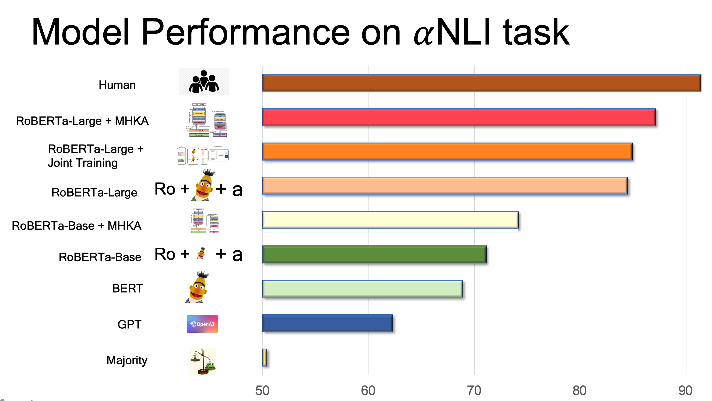

# Social-Commonsense-Reasoning-Multi-Head-Knowledge-Attention
 
Paper Link: https://www.aclweb.org/anthology/2020.findings-emnlp.267.pdf

This directory contains the following parts of the 'Social Commonsense Reasoning Multi-Head Knowledge Attention' experiment. 

<p align="center">
  
</p>

## Reference

If you make use of the contents of this repository, please cite [the following paper](https://www.aclweb.org/anthology/N19-1368):

```bib
@inproceedings{paul-frank-2020-mhka,
    title = "Social Commonsense Reasoning with Multi-Head Knowledge Attention",
    author = "Paul, Debjit  and Frank, Anette",
    booktitle = In Findings of the 2020 Conference on Empirical Methods in Natural Language Processing (EMNLP),
    month = November,
    year = 2020,
    publisher = "Association for Computational Linguistics"
}
```
## Requirements 
~~~~
- python3.8+
- pytorch
~~~~
Install the library and dependencies
~~~~
git clone https://github.com/huggingface/transformers
cd transformers
pip install .
pip install -r ./examples/requirements.txt
pip install tensorflow
pip install ftfy==5.1
conda install -c conda-forge spacy
python -m spacy download en
pip install tensorboardX
pip install tqdm
pip install pandas
pip install ipython
~~~~

## Recreating Results
<p align="center">
  
</p>
